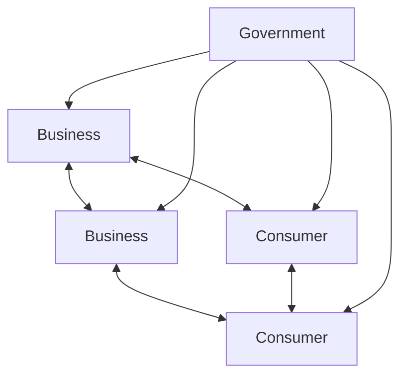
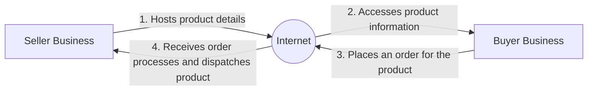
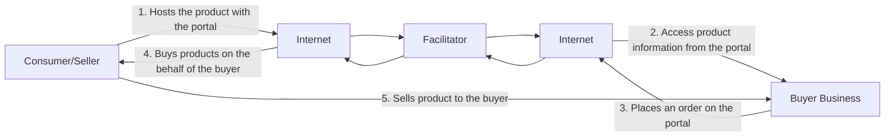
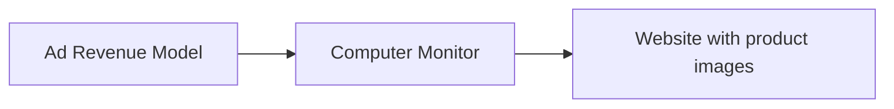

# CSC-370
## E - Commerce
### (BSc CSIT, TU)

Ganesh Khatri
kh6ganesh@gmail.com


# Chapter 2 - E-Commerce Business Model

```mermaid
graph TD
    subgraph Buyers
    B1((1)) --- B2((2)) --- B3((3)) --- BX[X]
    end
    
    subgraph "E-commerce Services"
    ES[Search] --- EV[Valuation] --- EL[Logistics] --- EP[Payment] --- EA[Authentication]
    end
    
    subgraph Sellers
    S1[1] --- S2[2] --- S3[3] --- SY[Y]
    end
    
    Buyers --> "E-commerce Services"
    "E-commerce Services" --> Sellers
```

**Fig. 2.1 Representation of an electronic market.**
# Chapter 2 - E-Commerce Business Model

- A business model is the method of doing business by which a company can sustain itself, that is, generate revenue.
- The business model spells out how a company makes money by specifying where it is positioned in the value chain.
- For our understanding, e-commerce can be defined as any form of business transaction in which the parties interact electronically.
- A transaction in an electronic market represents a number of interactions between parties.
- For instance, it could involve several trading steps, such as marketing, ordering, payment, and support for delivery.
- An electronic market allows the participating sellers and buyers to exchange goods and services with the aid of information technology.
# Chapter 2 - E-Commerce Business Model

- E-commerce can be formally defined as technology-mediated exchanges between parties (individuals, organizations, or both) as well as the electronically-based intra- or inter-organizational activities that facilitate such exchanges.
- It is global.
- It favours intangible (untouchable) things - ideas, information, and relationships.
- And it is intensely interlinked. These three attributes produce a new type of marketplace and society.
- In the new economy, companies are creating new business models and reinventing old models. Reading the literature, we find business models categorized in different ways.
# Chapter 2 - E-Commerce Business Model

- Presently, there is no single, comprehensive and cogent taxonomy of Web business models that one can point to.
- Although there are many different ways to categorize e-business models, they can be broadly classified as follows

# E-Business models based on the relationship of Transaction Parties

1. B2C
2. B2B
3. C2C
4. C2B

# E-Business models based on the relationship of Transaction Types

1. Brokerage
2. Aggregator
3. Info-mediary
4. Community
5. Value chain
6. Advertising


# E-BM models based on relationship of Transaction Parties

1. Business - to - Customer (B2C)
2. Business to Business (B2B)
3. Consumer to Consumer (C2C)
4. Consumer to Business (C2B)



Fig. 2.4 E-business transaction model.


# Business - to - Customer (B2C)

- involves transactions between business organizations and consumers.

- It applies to any business organization that sells its products or services to consumers over the Internet.

- These sites display product information in an online catalog and store it in a database

- The B2C model also includes services online banking, travel services, and health information and many more as shown in figure below

| Seller Business<br/>\[Image of buildings] | <----- 1. Hosts product details -----><br/><---- 4. Receives order processes and dispatches product ---- | Internet<br/>\[Cloud shape] | <---- 2. Accesses product information ----><br/>----- 3. Places an order for the product ----> | Consumer<br/>Buyer<br/>\[Image of person at computer] |
| ----------------------------------------- | -------------------------------------------------------------------------------------------------------- | --------------------------- | ---------------------------------------------------------------------------------------------- | ----------------------------------------------------- |

# Business - to - Customer (B2C)

- Consumers are increasingly going online to shop for and purchase products, arrange financing, arrange shipment or take delivery of digital products such as software, and get service after the sale.
- B2C e-business includes retail sales, often called e-retail (or e-tail), and other online purchases such as airline tickets, entertainment venue tickets, hotel rooms, and shares of stock.
- B2C e-business models include virtual malls, which are websites that host many online merchants.
- Virtual malls typically charge setup, listing, or transaction fees to online merchants, and may include transaction handling services and marketing options.
- Examples of virtual malls include excite.com, networkweb.com, amazon.com, Zshops.com, and yahoo.com.
# Business - to - Customer (B2C)

- Many people were very excited about the use of B2C on the Internet, because this new communication medium allowed businesses and consumers to get connected in entirely new ways.
- The opportunities and the challenges posed by the B2C e-commerce are enormous.
- A large amount of investment has gone into this and many sites have either come up or are coming up daily to tap this growing market.
# Business - to - Customer (B2C)

- Inexpensive costs, big opportunities: Once on the Internet, opportunities are immense as companies can market their products to the whole world without much additional cost.
- Globalization: Even being in a small company, the Web can make you appear to be a big player which simply means that the playing field has been levelled by e-business. The Internet is accessed by millions of people around the world, and definitely, they are all potential customers.
- Reduced operational costs: Selling through the Web means cutting down on paper costs, customer support costs, advertising costs, and order processing costs.
- Customer convenience: Searchable content, shopping carts, promotions, and interactive and user-friendly interfaces facilitate customer convenience. Thus, generating more business. Customers can also see order status, delivery status, and get their receipts online.
- Knowledge management: Through database systems and information management, you can find out who visited your site, and how to create better value for customers.


# Processes in B2C (How Does B2C Work?)

- B2C e-commerce is more than just an online store.

- It really is about managing the entire process, but just using technology as a tool for order processing and customer support

```mermaid
graph TD
    A[Customer identifies a need]
    B[Searches for the product or services to satisfy the need]
    C[Selects a vendor and negotiates a price]
    D[Receives the product or service<br>(delivery logistics, inspection<br>and acceptance)]
    E[Makes payment]
    F[Gets service and<br>warranty claims]
    
    A --> B
    B --> C
    C --> D
    D --> E
    E --> F
```

Fig. 2.5 Processes in B2C.

# Processes in B2C (How Does B2C Work?)

1. # Visiting the virtual mall :

- The customer visits the mall by browsing the online catalogue - a very organized manner of displaying products and their related information such as price, description, and availability.
- Finding the right product becomes easy by using a keyword search engine.
2. # Customer registers :

- The customer has to register to become part of the site's shopper registry.
- This allows the customer to use the shop's complete services.
- The customer becomes a part of the company's growing database and can use the same for knowledge management and data mining.
3. # Customer buys products :

- Through a shopping cart system, order details, shipping charges, taxes, additional charges and price totals are presented in an organized way.


# Processes in B2C (How Does B2C Work?)

1. Merchant processes the order:
- The merchant then processes the order that is received from the previous stage.
2. Credit card is processed:
- The credit card of the customer is authenticated through a payment gateway or a bank.
- Other payment methods can be used as well, such as debit cards, prepaid cards, or bank-to-bank transfers.
3. Operations management:
- When the order is passed on to the logistics people, the traditional business operations will still be used.
- Things like inventory management, total quality management, and project management should still be incorporated even though it is an e-business.

13
# Processes in B2C (How Does B2C Work?)

# 7. Shipment and delivery :

- The product is then shipped to the customer.
- The customer can track the order/delivery as virtual malls have a delivery tracking module on the website which allows a customer to check the status of a particular order.

# 8. Customer receives :

- The product is received by the customer, and is verified.
- The system should then tell the firm that the order has been fulfilled.

# 9. After-sales service :

- After the sale has been made, the firm has to make sure that it maintains a good relationship with its customers.


# Business - to - Business (B2B)

- involves electronic transactions for ordering, purchasing, as well as other administrative tasks between business houses.

- It includes trading goods, such as business subscriptions, professional services, manufacturing, and wholesale dealings

- Sometimes in the B2B model, business may exist between virtual companies, neither of which may have any physical existence.

- In such cases, business is conducted only through the Internet. Eg amazon



2
# Advantages of Business - to - Business (B2B)

- Direct interaction with customers:
- This is the greatest advantage of e-business
- Focused sales promotion:
- This information gives authentic data about the likes, dislikes and preferences of clients and thus helps the company bring out focused sales promotion drives which are aimed at the right audience.
- Building customer loyalty:
- It has been observed that online customers can be more loyal than other customers if they are made to feel special and their distinct identity is recognized and their concerns about privacy are respected.
- It has also been found that once the customers develop a binding relationship with a site and its product, they do not like to shift loyalties to another site or product.
# Advantages of Business - to - Business (B2B)

- Scalability :
- This means that the Web is open and offers round-the-clock access.
- This provides an access never known before, to the customer.
- This access is across locations and time zones.
- Thus a company is able to handle many more customers on a much wider geographical spread if it uses an e-business model.
- Savings in distribution costs :
- A company can make huge savings in distribution, logistical and after-sales support costs by using e-business models.
- Typical examples are of computer companies, airlines, and telecom companies.

Note : Due to large number of transactions involved, B2B operations can be too risky if e-business applications can not guarantee adequate quality of service in terms of performance, availability and security.
# Processes in B2B (How does B2B work)

- B2B interactions involve much more complexity than B2C.
- For instance, typical B2B transactions include the following steps:


# Consumer to Consumer(C2C)

- involves transaction between consumers.
- Here, a consumer sells directly to another consumer.
- eBay, bazee.com, hamrobazar are common examples of online auction Web sites that provide a consumer to advertise and sell their products online to another consumer.

| Consumer<br/>Seller     |                                                 |          |             | Consumer<br/>Buyer |                                                   |                         |
| ----------------------- | ----------------------------------------------- | -------- | ----------- | ------------------ | ------------------------------------------------- | ----------------------- |
| !Computer user icon | 1. Hosts the product with<br/>the portal        | Internet | Facilitator | Internet           | 2. Access product information<br/>from the portal | !Computer user icon |
|                         | 4. Buys products on the<br/>behalf of the buyer |          |             |                    | 3. Places an order on the<br/>portal              |                         |
| Seller                  | 5. Sells product to the buyer                   |          |             |                    |                                                   | Buyer                   |


6
# Consumer to Consumer (C2C)

- However, it is essential that both the seller and the buyer must register with the auction site.
- While the seller needs to pay a fixed fee to the online auction house to sell their products, the buyer can bid without paying any fee.
- The site brings the buyer and seller together to conduct deals.


# Consumer to Business(C2B)

- involves a transaction that is conducted between a consumer and a business organization.

- It is similar to the B2C model, however, the difference is that in this case the consumer is the seller and the business organization is the buyer


# Consumer to Business (C2B)

- In this kind of a transaction, the consumers decide the price of a particular product rather than the supplier.
- This category includes individuals who sell products and services to organizations.
- For example, monster.com, upwork.com, merojob.com is a Web site on which a consumer can post his bio-data for the services he can offer.
- Any business organization that is interested in deploying the services of the consumer can contact him and then employ him, if suitable.


# E-BM models based on relationship of Transaction Types

- Based on transaction type, different types of E-Business models can be identified as:

1. Brokerage Model
2. Aggregator Model
3. Infomediary Model
4. Community Model
5. Value Chain Model
6. Advertising Model

- These transaction types/models take place in a variety of ways.

- Moreover, any organization may combine one or two of these as part of its web business strategy
# Brokerage Model

- Brokers are market-makers: they bring buyers and sellers together and facilitate transactions.
- Brokers play a frequent role in B2B, B2C, or C2C markets.
- Usually a broker charges a fee or commission for each transaction it enables.
- The formula for fees can vary depending on context.
- Brokerage models include:
- Marketplace Exchange: offers a full range of services covering the transaction process, from market assessment to negotiation and fulfillment. Some examples are [Orbitz, ChemConnect]
- Buy/Sell Fulfillment: takes customer orders to buy or sell a product or service, including terms like price and delivery. Some examples are [CarsDirect, Respond.com]
# Brokerage Model

- Brokerage models include
- Auction Broker: conducts auctions for sellers (individuals or merchants). Broker charges the seller a listing fee and commission scaled with the value of the transaction. Auctions vary widely in terms of the offering and bidding rules. Some examples are eBay.
- Transaction Broker: provides a third-party payment mechanism for buyers and sellers to settle a transaction. Some examples are PayPal, Escrow.com.
- Search Agent: a software agent or "robot" used to search-out the price and availability for a good or service specified by the buyer, or to locate hard to find information.
- Virtual Marketplace: or virtual mall, a hosting service for online merchants that charges setup, monthly listing, and/or transaction fees. It may also provide automated transaction and relationship marketing services. Some examples are zShops and Merchant Services at Amazon.com.
# Aggregator Model

It is an e-commerce business model where a firm (that does not produce or warehouses any item) collects (aggregates) information on goods and/or services from several competing sources at its website.

The firm's strength lies in its ability to create an 'environment' which draws visitors to its website, and in designing a system which allows easy matching of prices and specifications.

# Aggregator model includes:

- Virtual Merchant: this is a business that operates only from the web and offers either traditional or web specific goods and services. The method of selling may be listing price or auction. Some examples include [Amazon, eToys]
- Catalog Merchant: Catalog business is a migration of mail order to web-based order business.
- Bit Vendor: This is the merchant that deals strictly in digital products and services in its purest form.
- Subscription model: the users have to pay for the access of the site. High value added content should be essential for subscription model. Some examples are [IEEE journal, Consumer Reports, Netflix, Lynda etc]

5
# Infomediary Model

- Data about consumers and their consumption habits are valuable, especially when that information is carefully analyzed and used to target marketing campaigns.
- Independently collected data about producers and their products are useful to consumers when considering a purchase.
- Some firms function as infomediaries (information intermediaries) assisting buyers and/or sellers understand a given market.

# Infomediary model includes:

- Advertising Networks: feed banner ads to a network of member sites, thereby enabling advertisers to deploy large marketing campaigns. Ad networks collect data about web users that can be used to analyze marketing effectiveness.
- Audience Measurement Services: online audience market research agencies.
# Infomediary Model

- Infomediary model includes:
- Incentive Marketing: customer loyalty program that provides incentives to customers such as points or coupons for making purchases from associated retailers. Data collected about users is sold for targeted advertising.
- Metamediary: facilitates transactions between buyer and sellers by providing comprehensive information and services, without being involved in the actual exchange of goods or services between the parties.

7

# Community Model

- The ability of the community model is based on user loyalty.
- Users have a high investment in both time and emotion.
- Revenue can be based on the sale of ancillary products and services or voluntary contributions; or revenue may be tied to contextual advertising and subscriptions for premium services.
- The Internet is inherently suited to community business models and today this is one of the more fertile areas of development, as seen in rise of social networking.
- Community Model includes:
- Open Source: software developed collaboratively by a global community of programmers who share code openly. Some examples are [Red Hat, Linux, PHP]


# Community Model

- Open Content: openly accessible content developed collaboratively by a global community of contributors who work voluntarily. [Wikipedia]
- Public Broadcasting: user-supported model used by not-for-profit radio and television broadcasting extended to the web. A community of users support the site through voluntary donations. [The Classical Station (WCPE.org)]
- Social Networking Services: sites that provide individuals with the ability to connect to other individuals along a defined common interest (professional, hobby, romance). Social networking services can provide opportunities for contextual advertising and subscriptions for premium services. [Facebook, Instagram, twitter etc]
# Value Chain Model

- Value chain selling is supported through two business models: demand chain and a supply chain.
- E-Commerce supports the transactions through both the demand chain business model and supply chain business model.
- Products, goods, services, or information are delivered through the parties of the value chain from producers to end users.
- A value chain also has relationship and administrative aspects, that is, you can manage the relationship of the partners or enterprises in your value chain, as well as offer some administrative services to those parties.
- As a result, value chain business models must manage the two sides of their businesses: their customers and direct sales, and their channel partners and suppliers. Each requires its own management channels and practices.
# Advertising Model

The web advertising model is an extension of the traditional media broadcast model.

The broadcaster, in this case, a web site, provides content (usually, but not necessarily, for free) and services (like email, IM, blogs) mixed with advertising messages in the form of banner ads.

The banner ads may be the major or sole source of revenue for the broadcaster.

The advertising model works best when the volume of viewer traffic is large or highly specialized.

# Advertising model includes:

- Portal: usually a search engine that may include varied content or services. A high volume of user traffic makes advertising profitable and permits further diversification of site services. Some common examples are [Google, Yahoo!]
# Advertising Model

- Advertising model includes:
- Classifieds: list items for sale or wanted for purchase. Listing fees are common, but there also may be a membership fee. [Monster.com, Craigslist]
- User Registration: content-based sites that are free to access but require users to register and provide demographic data. Registration allows inter-session tracking of user surfing habits and thereby generates data of potential value in targeted advertising campaigns.
- Contextual Advertising / Behavioral Marketing: For example, a browser extension that automates authentication and form fill-ins, also delivers advertising links or pop-ups as the user surfs the web. Contextual advertisers can sell targeted advertising based on an individual user's surfing activity.

12

# E-Commerce Business/Revenue Model

In business, revenue typically consists of the total amount of money received by the company for goods sold or services provided during a certain time period. Therefore, revenue models are a part of the business model.

Many online companies generate revenues from multiple income streams such as advertising, subscription, marketing etc.

# There are five revenue models.

1. Advertising Revenue Model
2. Subscription Revenue Model
3. Transaction Fee Revenue Model
4. Sales Revenue Model
5. Affiliate Revenue Model


# Advertising Revenue Model

- Generally, there is always a commission charged to advertisers to put up their advertisements in a well known online marketing platform.

- This is the classic principle that is being followed for the business categorized for the Advertising Revenue model.

- They take advantage of the huge traffic who regularly visit the chosen platform to shop around, see the ad and get redirected to the actual site



14
# Advertising Revenue Model

• Business following the Advertising Revenue Model presents an indirect way of earning revenue through a digital platform and the conventional ways of putting up ads generally include display marketing that includes a super banner, wallpaper, skyscraper or rectangular ads.

• Google Adsense are the most trending and reliable options that allow you to place your ads through the Google Search engine allowing you to bring your business website to the top of the search results when searched with the related keywords.

15


# Subscription Revenue Model

- You must have heard of Netflix, Amazon Prime, YouTube Premium, etc who will let you enjoy their unlimited services.

- These eCommerce business models charge their users or rather subscribers based on a certain interval of time (daily, monthly or annual) to avail their services.

- The service offerings of these companies generally include music, videos, TV channels, magazines, special services, etc. which is offered to the subscribers for a price to watch/listen or get the latest edition

| SUBSCRIPTION BASED MODEL<br/>➜ | 3-MONTH   | 6-MONTH   | 1-YEAR    |
| ------------------------------ | --------- | --------- | --------- |
|                                | SUBSCRIBE | SUBSCRIBE | SUBSCRIBE |


# Transaction Fee Revenue Model

- The eCommerce business following the transaction fee revenue model charges a fee to a seller for every transaction made through them.

- They are the payment companies that provides the payment gateway service to other eCommerce business platforms.

- Generally, the profit is derived through enabling or executing transactions

![An image showing a PayPal transaction interface with a red arrow pointing to the "TRANSACTION FEES MODEL" button. The interface displays a table with columns for Date, Type, Name, Payment, Gross, Fee, Net, Balance, and Actions. Two sample transactions are visible, demonstrating how fees are applied to payments.]

# Transaction Fee Revenue Model

- The operator provides a platform for the eCommerce marketplace through which the transaction can be completed.
- Now, the necessary steps include registering of the vendor and the operator so that the identities are kept intact that may later be required for a business.


# Sales Revenue Model

- This is the most commonly followed eCommerce business model where wholesalers and retailers sell their product over the internet intending to reach out to a larger target audience.

- often competitive in comparison to the actual store price.

- The business following the online sales model often comes with marketplaces as common entry points that allow them to deal with various product vendors allowing them to grow the marketplace and therefore earn more

The image illustrates the Sales Revenue Model concept:
- It shows two cartoon figures appearing excited, with one holding up a sign that says "90% SALE"
- On the right side, there's a representation of an online store with a shopping cart, shopping bag, and groceries
- A red banner in the top right corner of the image reads "SALES REVENUE MODEL"


# Affiliate Revenue Model

- is a revenue model which deals with a business that follows the principle of commission.

- Merchants and vendors partner up with well-known eCommerce platforms to advertise and sell their product giving them a percentage of the profit as a commission.

- An affiliate marketing is a well-known way of inviting as well as driving quality leads into their business.

<div style="background-color: #FFE4B5; padding: 10px;">
    <div style="background-color: #FF4500; color: white; padding: 5px; display: inline-block; border-radius: 5px;">
        AFFILIATE REVENUE MODEL ➔
    </div>
</div>
# Affiliate Revenue Model

- The process basically works as a link that is hyperlinked to the affiliate and is archived on a host platform that gets regular traffic.
- Any user who clicks to the affiliate link is redirected to their website where the product or service is cataloged.
- The affiliate or the merchant thus pays an agreed commission to the host operator who’s carrying the link for every traffic driven.


# Electronic Data Interchange (EDI)

- the inter-process communication (computer application to computer application) of business information in a standard electronic form

- In short, EDI communicates information for business transactions between the computer systems of companies, government organizations, small businesses, and banks

- Using EDI, trading partners establish computer-to-computer links that enable them to exchange information electronically

- This allows businesses to better cope with a growing avalanche(too many) of paperwork: purchase orders, invoices, confirmation notices, shipping receipts, and other documents

- With the aid of EDI, all these documents are in electronic form, which aliases more work automation to occur and even alters the way business is done

# Electronic Data Interchange (EDI)

- Many industries see EDI as essential for reducing cycle and order fulfillment times.
- In retailing, EDI can provide vendors with a snapshot of what stores are selling, enabling them to recognize and meet their customer's needs much faster than in the past.
- In addition, it enables retailers and vendors to place orders and pay bills electronically, reducing time and the expense of paperwork.
- The primary benefit of EDI to business is a considerable reduction in transaction costs, by improving the speed and efficiency of filling orders.
- Studies show that it takes up to five times as long to process a purchase order manually as it does electronically.


# Electronic Data Interchange (EDI)

- Despite these advantages, EDI is not (yet) widely used.
- It is estimated that out of millions of businesses in the United States, only 44,000 companies exchange business data electronically.
- Only about 10 percent of these companies use EDI for financial transactions.
- Electronic commerce is often equated with EDI, so it is important to clarify that electronic commerce embraces EDI and much more.
- In electronic commerce, EDI techniques are aimed at improving the interchange of information between trading partners, suppliers, and customers by bringing down the boundaries that restrict how they interact and do business with each other.
- Technically speaking, EDI is one well-known example of structured document interchange which enables data in the form of document content to be exchanged between software applications that are working together to process a business transaction.


# EDI Layered Architecture

- EDI architecture specifies four layers :
    1. the semantic (or application) layer
    2. the standard translation layer
    3. the packing (or transport) layer
    4. the physical network infrastructure layer

| EDI Layer           | Application Layer Services       | Application Layer Services |
| ------------------- | -------------------------------- | -------------------------- |
| EDI semantic layer  | EDIFACT business form standards  |                            |
| EDI standard layer  | ANSI X12 business form standards |                            |
| EDI transport layer | Electronic mail                  | X.435, MIME                |
|                     | Point to point                   | FTP, TELNET                |
|                     | World Wide Web                   | HTTP                       |
| Physical layer      | Dial-up lines, Internet, I-way   |                            |

# EDI Semantic Layer

- The EDI semantic layer describes the business application that is driving EDI.
- For a procurement application, this translates into requests for quotes, price quotes, purchase orders, acknowledgments, and invoices.
- This layer is specific to a company and the software it uses.
- In other words, the user interface is customized to local environments.
# EDI Standard Layer

- The information seen at the EDI semantic layer must be translated from a company-specific form to a more generic or universal form so that it can be sent to various trading partners, who could be using a variety of software applications at their end.
- To achieve this, companies must adopt universal EDI standards that lay out the acceptable fields of business forms.
- What complicates matters is the presence of two competing standards that define the content and structure of EDI forms: the X12 standard, developed by the American National Standards Institute (ANSI), and EDIFACT, developed by United Nations Economic Commission for Europe (UN /ECE).
# EDI Transport Layer

• When the trading partner sends a document, the EDI translation software converts the proprietary format into a standard mutually agreed on by the processing systems.

• When a company receives the document, their EDI translation software automatically changes the standard format into the proprietary format of their document processing software so that the company can manipulate the information in whatever way it chooses to.


# Electronic Data Interchange versus E-mails

- EDI document transport is far more complex than simply sending e-mail messages or sharing files through a network.

- These EDI documents are more structured than e-mail.

- What really differentiates EDI from messaging is its emphasis on the automation of business transactions conducted between organizations.

- In addition, EDI messages have certain legal status.

- For instance, if a buyer sends a supplier EDI purchase orders that specify the requirements, time of delivery, and quantity and the supplier does not uphold its end of the contract, it can be taken to court with the EDI trading agreements serving as evidence.

- Table below indicates some EDI properties which distinguish it from e-mail


# Electronic Data Interchange versus E-mails

| Electronic Data Interchange (EDI)                                                                                                                                                              | Electronic Mail                                                                                                                                              |
| ---------------------------------------------------------------------------------------------------------------------------------------------------------------------------------------------- | ------------------------------------------------------------------------------------------------------------------------------------------------------------ |
| There is typically no human involvement in the processing of the information, as the interface has software-to-software orientation. The data are structured in a software-understandable way. | The data are not necessarily structured to be software-understandable. A human-to-software interface is involved at a minimum of one end of the interchange. |
| The interchange is composed by one software for interpretation by another software. If a reply is involved, it is composed by a software to be interpreted by another software.                | The message is composed by a human and/or interpreted by a human and/or a reply is composed by a human and/or interpreted by a human.                        |


# Benefits of EDI

- EDI can be a cost- and time-saving system, for many reasons.

- The automatic transfer at information from computer to computer reduces the need to rekey information and as such reduces costly errors to near zero.

- EDI transactions produce acknowledgments of receipt of data.

- Many firms are now finding that this acknowledgment can make the invoice obsolete and save many efforts now devoted to acquiring, receiving, and paying for goods

1. Reduced paper-based systems
2. Improved problem resolution and customer service
3. Expanded customer/supplier base

# Benefits of EDI

1. Reduced paper-based systems:
- EDI can impact the effort and expense a company devotes to maintaining records, paper-related supplies, and to the personnel required to maintain all of these systems.
- Electronic transactions takeover most of the functions of paper forms and through automation drastically reduce the time spent to process them.
- EDI can also reduce postage bills because of the amounts of paper that no longer need be sent.


# Benefits of EDI

# 2. Improved problem resolution and customer service:

- EDI can minimize the time companies spend to identify and resolve inter-business problems.
- Many such problems come from data-entry errors somewhere along the way, and EDI can eliminate many of them.
- EDI can improve customer service by enabling the quick transfer of business documents and a marked decrease in errors and so can fill orders faster and by providing an automatic audit trail that frees accounting staff for more productive activities.
# Benefits of EDI

# 3. Expanded customer/supplier base:

- Many large manufacturers and retailers are ordering their suppliers to institute an EDI program.
- Today, when evaluating a new product to carry or a new supplier to use, the ability to implement EDI is a big plus in their eyes.
- These same companies tend to stop doing business with suppliers who do not comply with EDI.
# EDI Applications in various fields of Business

- Although EDI was developed to improve transportation and trade, it has spread everywhere.
- An examination of EDI usage in various industries provides insight into the business problems that EDI is attempting to solve.
- We will present four very different scenarios in industries that use EDI extensively:
- International or cross-border trade
- Financial EDI or electronic funds transfer (EFT)
- Health care EDI for insurance claims processing
- Manufacturing and retail procurement

# EDI Applications in various fields of Business

# 1. International or cross-border trade :

- EDI has always been very closely linked with international trade.
- Over the last few years, significant progress has been made toward the establishment of more open and dynamic trade relations.
- These developments have meant the lifting of long-standing trade restrictions.
- Many countries, and in particular developing countries, have made significant efforts to liberalize and adjust their trade policies.
- In this context, trade efficiency, which allows faster, simpler, broader and less costly transactions, is a necessity.
- It is a widely held view that trade efficiency can be accomplished only by using EDI as a primary global transactions medium.


# EDI Applications in various fields of Business

# 2. Financial EDI or electronic funds transfer (EFT):

- Financial EDI comprises the electronic transmission of payments and remittance information between a payer, payee, and their respective banks.
- This section examines the ways business-to-business payments are made today and describes the various methods for making financial EDI payments.
- Financial EDI allows businesses to replace the labor-intensive activities associated with issuing, mailing, and collecting checks through the banking system with automated initiation, transmission, and processing of payment instructions.
- Thus it eliminates the delays inherent in processing checks.


# EDI Applications in various fields of Business

# 3. Health care EDI for insurance claims processing :

- Providing good and affordable health care is a universal problem.
- In 1994, the American public spent $1 trillion on health care, nearly 15 percent of the gross domestic product (GDP).
- National health care expenditures have risen by 10.5 percent each year for the past eight years — more than double the rate of increase in the consumer price index.
- It is estimated that $3.2 billion in administrative savings are expected to be achieved by switching from being paper-based to an EDI implementation.
- Employers could save $70 million to $110 million by using EDI for enrollment and to certify that a prescribed procedure is covered under the subscriber's health insurance contract.


# EDI Applications in various fields of Business

# 4. Manufacturing and retail procurement :

- Both manufacturing and retail procurement are already heavy users of EDI.
- In manufacturing, EDI is used to support just-in-time. In retailing, EDI is used to support quick response.
- Just-in-Time and EDI: Companies using JIT and EDI no longer stock thousands of large parts in advance of their use. Instead, they calculate how many parts are needed each day based on the production schedule and electronically transmit orders and schedules to suppliers every day or in some cases every 30 minutes. Parts are delivered to the plant "just in time" for production activity.
- Quick Response and EDI: Taking their cue from the efficiencies manufacturers have gained from just-in-time manufacturing techniques, retailers are redefining practices through the entire supply chain using quick response (QR) systems. For the customer, QR means better service and availability of a wider range of products. For the retailer and suppliers, QR may mean survival in a competitive marketplace.
# Security and Privacy issues of EDI

- Since in the case of EDI, we are dealing with trade between countries and corporations, issues of legal admissibility and computer security are important.
- Companies that deal with EDI often retain the services of a lawyer during the design of an EDI application so that the appropriate evidentiary/admissibility safeguards are implemented
# Security and Privacy issues of EDI

# Legal Status of EDI Messages :

- There has been considerable debate concerning the legal status of EDI messages and electronic messages in general.
- Although a lot of work is being done on legal framework, nothing concrete has come out these efforts.
- No rules exist that indicate how electronic messages may be considered binding in business or other related transactions.
- The establishment of such a framework is essential if EDI is to become widespread.
# Security and Privacy issues of EDI

# Digital Signatures and EDI :

- The cryptographic community is exploring various technical uses of digital signatures by which messages might be time-stamped or digitally notarized to establish dates and times at which a recipient might claim to have had access or even read a particular message.
- If digital signatures are to replace handwritten signatures, they must have the same legal status as handwritten signatures (documents signed with digital signatures must be legally binding).
- Digital signatures should have greater legal authority than handwritten signatures.
- For instance, if a ten-page contract is signed by hand on the tenth page, one cannot be sure that the first nine pages have not been altered.
- If the contract was signed by digital signatures, however, a third party can verify that not one byte of the contract has been altered.

# Security and Privacy issues of EDI

# Digital Signatures and EDI :

- The cryptographic community is exploring various technical uses of digital signatures by which messages might be time-stamped or digitally notarized to establish dates and times at which a recipient might claim to have had access or even read a particular message.
- If digital signatures are to replace handwritten signatures, they must have the same legal status as handwritten signatures (documents signed with digital signatures must be legally binding).
- Digital signatures should have greater legal authority than handwritten signatures.
- For instance, if a ten-page contract is signed by hand on the tenth page, one cannot be sure that the first nine pages have not been altered.
- If the contract was signed by digital signatures, however, a third party can verify that not one byte of the contract has been altered.

